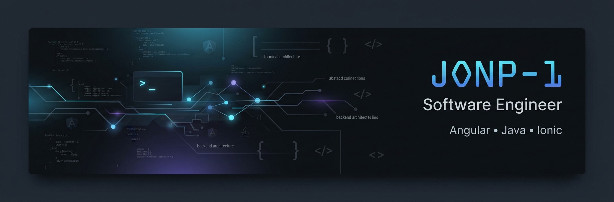

<h1 align="center">¡Hola! 👋 Soy JONP</h1> <h3 align="center">Desarrollador Angular / Ionic | Backend en PHP</h3>

## 🚀 Sobre mí

- 💼 Desarrollador con experiencia construyendo aplicaciones web y móviles con Angular e Ionic
- 🛠️ Experiencia en backend con PHP y MySQL
- ⚡ Me interesa el desarrollo mobile híbrido y las buenas prácticas de código

## 🧰 Stack tecnológico

### 💼 Con experiencia:

 &nbsp; &nbsp; &nbsp; &nbsp; &nbsp; &nbsp; &nbsp; 

### 🌱 Aprendiendo actualmente:

 &nbsp; &nbsp; 

