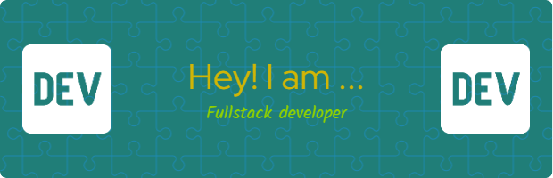

<h1 align="center">Hi 👋, I'm JONP-1</h1>
<h3 align="center">A passionate full stack developer.</h3>
<h3 align="left">Languages and Tools:</h3>

  

  

  
  

 
- 🌱 I’m currently learning Python and NestJS.
  

<!--
**JONP-1/JONP-1** is a ✨ _special_ ✨ repository because its `README.md` (this file) appears on your GitHub profile.

Here are some ideas to get you started:

- 🔭 I’m currently working on ...
- 🌱 I’m currently learning ...
- 👯 I’m looking to collaborate on ...
- 🤔 I’m looking for help with ...
- 💬 Ask me about ...
- 📫 How to reach me: ...
- 😄 Pronouns: ...
- ⚡ Fun fact: ...
-->
